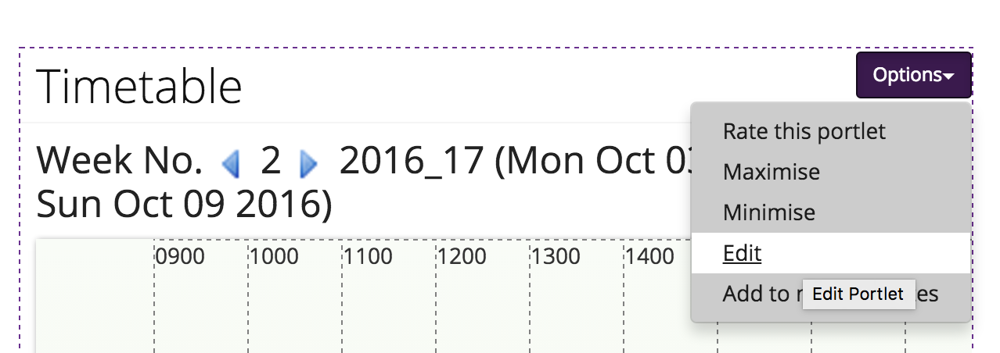
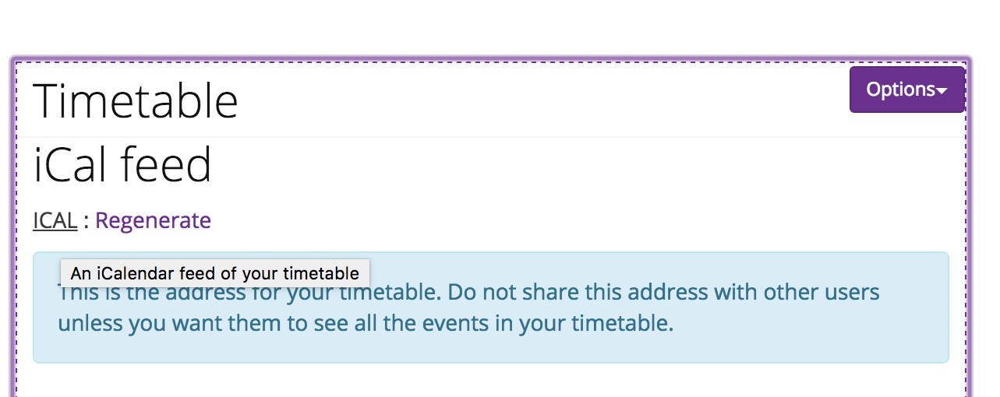
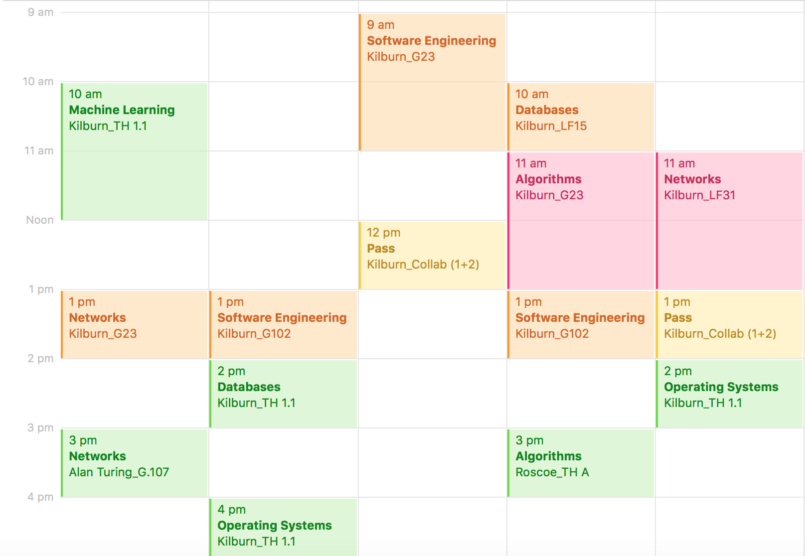

# CSTimetableConverter

## Installation

1. Clone or download repository

2. Within directory install requirements:

	```
	pip install -r requirements.txt
	```

3. Fill in calendar URL in `load_timetable.py` (available from MyManchester):

	```
	url = ''
	```

	The timetable widget can be found within on the MyManchester homepage:
	


	The URL can be found in the edit section of the widget:
	
	
4. Edit converted name:

	```
	'COMP25111':'Operating Systems',
	'COMP26120':'Algorithms and Imperitive Programming',
	'COMP28411':'Computer Networks'
	```
	
5. Run the script:

	```
	python load_timetable.py
	```
	
6. Import as a new calendar

7. Run regularly to ensure calendar remains up to date

--------

## Split Calendar

The `load_split_timetables.py` script can be used to create 4 different calendar files based on event description e.g if event contains "LECTURE" in description put it in the Lecture calendar.

The groupings are Labs, Lectures, Workshops / Examples and Other (as seen below).




The split calendar script can be ran by following the instructions above steps 1 - 4 then running:

```
python load_timetable.py
```

the script will create 4 ics files: Labs, Lectures, Workshops and Other. Open all of these as new calendars and run regularly to ensure they remain up to date.